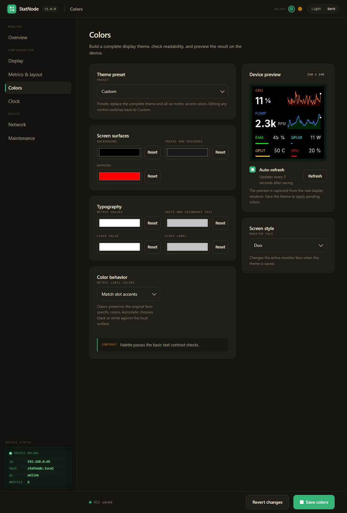

# PCMonitorColor

Live PC sensor monitor for small ESP32 color displays. A companion app on your
PC streams sensor readings (CPU, GPU, RAM, temps, fans, power, ...) over the
LAN; the device renders them on a 240x240 panel with selectable "faces", a web
config portal, and animated idle clocks.

Firmware only talks UDP to the companion — no cloud, no accounts.

## Monitor faces

Six layouts, all driven by the same six ordered metric slots (slot 1 = hero).
Switch face live from the web portal.

| Big numbers | Tiles + sparklines | Hero + list |
|---|---|---|
|  |  |  |
| **Strips** | **Duo** | **Pulse** |
|  |  |  |

<sub>Captures are pulled from the device via `/screen.bmp`; the greenish cast is
RGB332 quantization in the capture only — the real panel blacks are true black.</sub>

When the PC goes offline the screen shows an idle clock: **Standard**,
**Breakout**, or an animated **Mario** face (portal, Clock page).

## Web portal

Browse to the device IP or `http://pcmonitor.local`. Everything is applied live
without a reboot (except network changes).

| Overview | Metrics & layout | Colors |
|---|---|---|
|  |  |  |

Pages: **Overview** (live preview + health), **Display** (face, brightness,
night schedule, touch), **Metrics & layout** (drag metrics into slots),
**Colors** (theme presets + contrast check), **Clock**, **Network**,
**Maintenance** (config backup/restore, factory reset, OTA).

## How it works

```
PC companion app  --UDP :4210 JSON-->  ESP32  -->  240x240 panel + web portal
```

The companion (PCMonitorColor Companion) discovers PC sensors, lets you pick
which to send, and pushes a JSON packet each second. The device binds each
metric by id to a display slot. If packets stop, it flips to the idle clock.

### Sensor source (Windows): LibreHardwareMonitor

On Windows the companion reads its sensor data from
[LibreHardwareMonitor (LHM)](https://github.com/LibreHardwareMonitor/LibreHardwareMonitor),
so **LHM must be running** for readings to appear. Run it as administrator for
full CPU/GPU/board coverage, then either:

- **REST API** (default, LHM 0.9.5+): enable *Options → Remote Web Server* (port
  `8085`). The companion prefers this and reads `/data.json`.
- **WMI**: the companion falls back to the `root\LibreHardwareMonitor` namespace.

The device's status dot shows `LHM off` (red) when LHM is not running. On Linux
the companion reads sensors directly and does not need LHM.

## Supported hardware

All maintained boards are **ST7789 240x240** square panels:

| Env | Board |
|---|---|
| `esp32s3` (default) | LOLIN ESP32-S3 Mini + ST7789 |
| `esp32s3_zero` | Waveshare ESP32-S3-Zero + ST7789 |
| `ws_lcd_154` | Waveshare ESP32-S3-Touch-LCD-1.54 |
| `esp32c3` | LOLIN ESP32-C3 Mini + ST7789 |

## Build & flash

Built with [PlatformIO](https://platformio.org/).

```sh
# build the default env
pio run

# build + USB flash a specific board
pio run -e esp32c3 -t upload

# OTA update an already-running device
curl -F "firmware=@.pio/build/esp32c3/firmware.bin" http://<device-ip>/ota/upload
```

## First-run setup

1. Flash the firmware and power the device.
2. On first boot it opens a WiFi AP **`PCMonitor-XXXX`** (password `pcmon1234`).
   Connect and the captive portal opens at `http://192.168.4.1`; enter your WiFi.
   (Improv-over-USB-serial also works in the first 3 minutes.)
3. After it joins your network, open the device IP / `pcmonitor.local`, bind
   your metrics on **Metrics & layout**, and start the PC companion.
