# StatNode

Live PC sensor monitor for small ESP32 color displays. A companion app on your
PC streams sensor readings (CPU, GPU, RAM, temps, fans, power, ...) over the
LAN; the device renders them on a small color panel with selectable "faces", a
web config portal, and animated idle clocks.

Firmware only talks UDP to the companion. No cloud, no accounts.

StatNode is the color evolution of my
[SmallOLED-PCMonitor](https://github.com/Keralots/SmallOLED-PCMonitor), the
128x64 OLED variant, which is still actively developed.

## Monitor faces

A face is two settings, not one: a **layout** says how the bound metrics are
arranged, a **surface** says how that arrangement is painted. Four layouts by
four surfaces gives twelve faces, all driven by the same eight ordered metric
slots (slot 1 = hero). Switch face live from the web portal.

|  | Flat | Aero glass | Liquid glass | Load wash |
|---|---|---|---|---|
| **Big numbers** | Big numbers | - | - | - |
| **Tiles** | Tiles | Aero glass tiles | Liquid glass tiles | Pulse |
| **Strips** | Strips | - | - | Washed strips |
| **Duo** | Duo, Hero + list | Aero glass duo | Liquid glass duo | Washed duo |

How many readings appear is simply how many slots you bind, and every face lays
itself out from that count, so there is no separate "tile count" setting to
disagree with your bindings. The Duo layout adds two options of its own: how
many hero bands it opens with (one or two), and whether the remaining metrics
fill a grid or full-width list rows. One band plus list rows is the face
previously called Hero + list.

Values are rendered from native font faces sized to the space they have, never
magnified, so the big readings stay crisp on the small square panels as well as
on the 320x480 Guition.

| Big numbers | Tiles | Aero glass tiles |
|---|---|---|
| 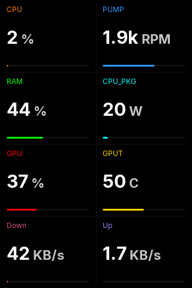 | 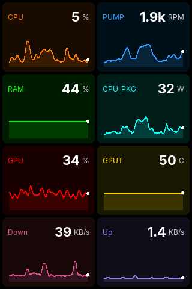 | 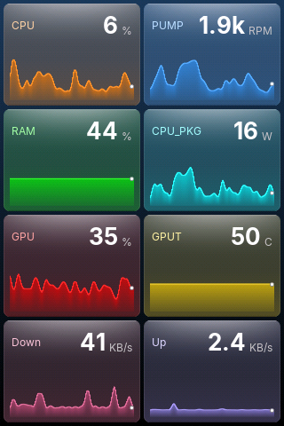 |
| **Liquid glass tiles** | **Pulse** | **Strips** |
| 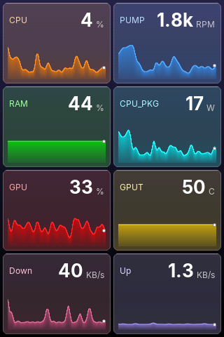 | 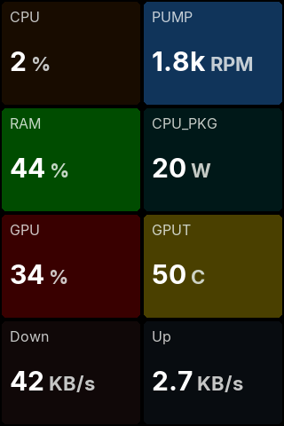 | 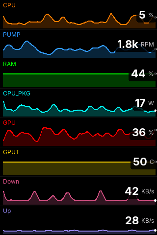 |
| **Washed strips** | **Hero + list** | **Duo** |
| 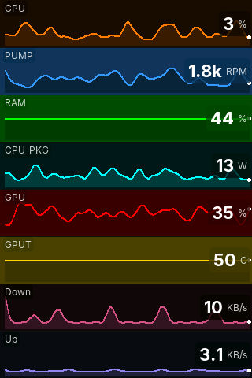 | 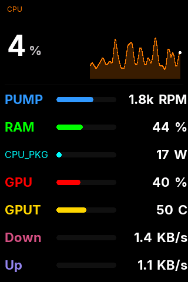 | 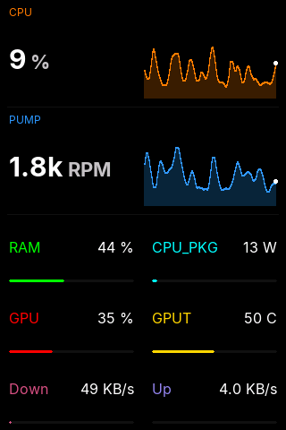 |
| **Aero glass duo** | **Liquid glass duo** | **Washed duo** |
| 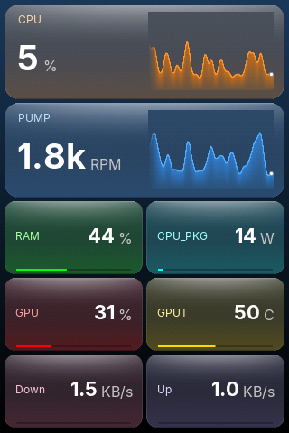 | 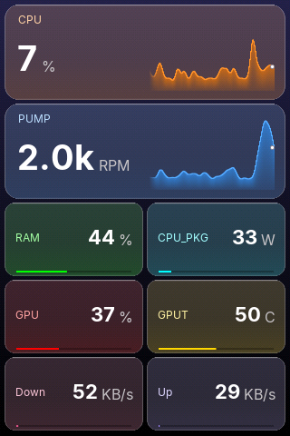 | 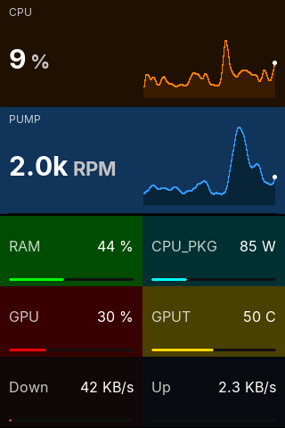 |

<sub>Captured on the 320x480 Guition through `/screen.bmp`, default colorway.</sub>

### Surfaces

**Flat** paints in the colors from the portal's Colors page. **Load wash** tints
each slot's ground by its own reading, quantized into eight steps with
hysteresis so a value sitting on a boundary does not flicker between them; it is
built for reading the machine's state from across the room rather than reading
digits.

The two **glass** surfaces render every card as a pane over a generated
backdrop: Aero glosses the face of each pane, Liquid leaves the face clear and
lights the edges. The backdrop is a smooth vertical gradient, composed well
above the panel's color depth and dithered on the way down to it, so the panes
stay banding-free.

Both take a **colorway**, set on the portal's Display page: *Default*, which
follows your background color as smoked glass, and two frosted presets. Gloss,
bow and chart fill are sliders on the same card and apply live as you drag them.
The colorway applies to whichever layout is wearing the glass.

| Default | Frosted glass dark | Frosted glass light |
|---|---|---|
| 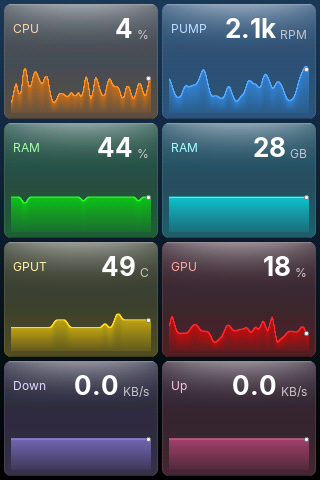 | 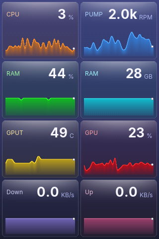 | 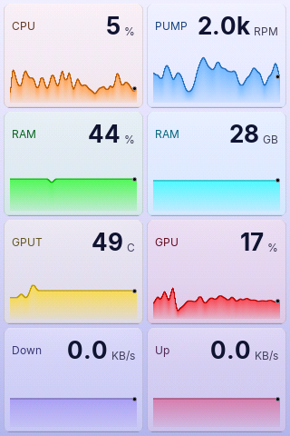 |
| 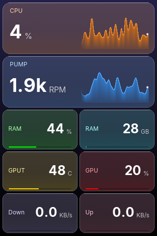 | 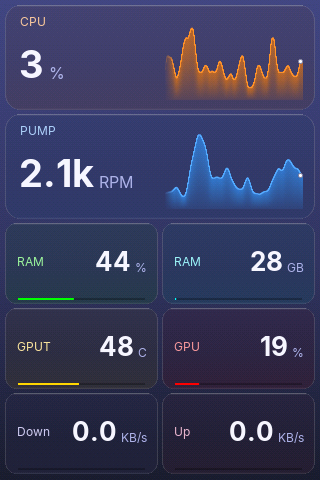 | 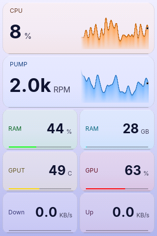 |

<sub>Top row Aero, bottom row Liquid, captured on the 320x480 Guition. That
board has PSRAM, so these are true 16-bit captures with no color shift.</sub>

Charts on every face glide between packets rather than stepping, and the frame
interval is paced off what the last frame actually cost, so a heavy face on a
big panel slows itself down instead of starving WiFi.

When the PC goes offline the screen shows an idle clock: **Standard**,
**Breakout**, or an animated **Runner** face (portal, Clock page).

## Web portal

Browse to the device IP or `http://statnode.local`. Everything is applied live
without a reboot (except network changes).

| Overview | Display | Metrics & layout |
|---|---|---|
| 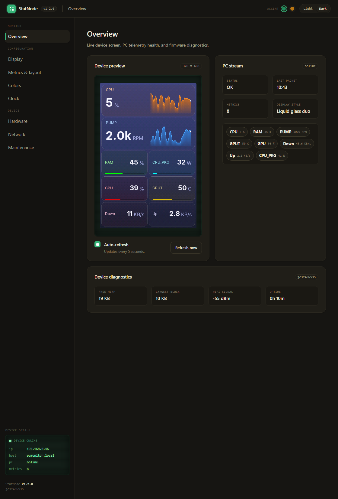 | 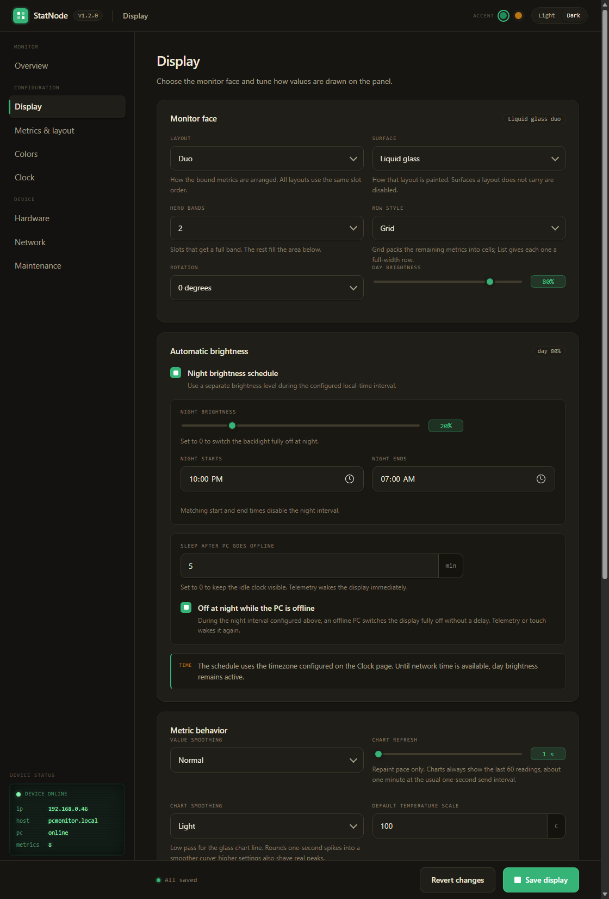 | 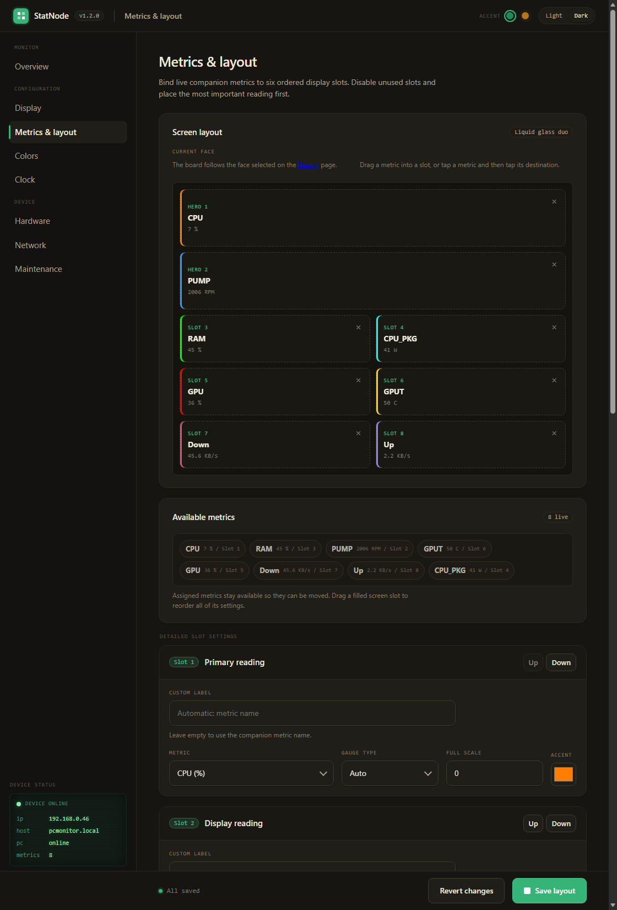 |

Pages: **Overview** (live preview + health), **Display** (face, brightness,
night schedule), **Metrics & layout** (drag metrics into slots), **Colors**
(theme presets + contrast check), **Clock**, **Hardware** (touch pad, status
LED), **Network**, **Maintenance** (config backup/restore, factory reset, OTA).

## Optional peripherals

Both are off by default and configured on the portal's **Hardware** page. Only
GPIOs that cannot break the display, USB or boot are offered, and the page lists
the allowed pins for your board.

- **Capacitive touch pad (TTP223):** assign a tap and a hold action - next or
  previous face, toggle the idle clock, or switch the display off. You choose
  which faces the cycling walks through.
- **Status LED:** a single-color LED on a GPIO, driven through a transistor and
  dimmed by PWM (not an addressable strip). It has its own night level, can go
  dark whenever the display is dark, and can go dark while the PC is offline.
  The brightness slider drives the real LED live while the page is open.

## How it works

```
PC companion app  --UDP :4210 JSON-->  ESP32  -->  color panel + web portal
```

The companion (StatNode Companion) discovers PC sensors, lets you pick
which to send, and pushes a JSON packet each second. The device binds each
metric by id to a display slot. If packets stop, it flips to the idle clock.

The PC and the device must be on the same LAN/subnet, with UDP port `4210`
reachable from the PC to the device.

### Sensor source (Windows): LibreHardwareMonitor

On Windows the companion reads its sensor data from
[LibreHardwareMonitor (LHM)](https://github.com/LibreHardwareMonitor/LibreHardwareMonitor),
so **LHM must be running** for readings to appear. Run it as administrator for
full CPU/GPU/board coverage, then either:

- **REST API** (default, LHM 0.9.5+): enable *Options > Remote Web Server* (port
  `8085`). The companion prefers this and reads `/data.json`.
- **WMI**: the companion falls back to the `root\LibreHardwareMonitor` namespace.

The device's status dot shows `LHM off` (red) when LHM is not running. On Linux
the companion reads sensors directly and does not need LHM.

## Companion app

Source and a prebuilt Windows build live in this repo under
[`StatNode-CompanionApp/`](StatNode-CompanionApp/).

- **Windows:** run `win-companion/dist/StatNodeCompanion.exe`, or from
  source `python win-companion/statnode_companion.py` (deps in
  `win-companion/requirements.txt`).
- **Linux:** `python linux-companion/statnode_companion_linux.py` (deps in
  `linux-companion/requirements.txt`).

It opens a local UI at `http://127.0.0.1:8740` where you pick the target device,
choose which sensors to stream, and set the send interval. See the
[companion README](StatNode-CompanionApp/README.md) for details.

## Supported hardware

| Env | Board | Panel |
|---|---|---|
| `esp32s3` (default) | LOLIN ESP32-S3 Mini + ST7789 | 240x240 |
| `esp32s3_zero` | Waveshare ESP32-S3-Zero + ST7789 | 240x240 |
| `ws_lcd_154` | Waveshare ESP32-S3-Touch-LCD-1.54 | 240x240 |
| `esp32c3` | LOLIN ESP32-C3 Mini + ST7789 | 240x240 |
| `jc3248w535` | Guition JC3248W535 (3.5", 16MB / 8MB PSRAM) | 320x480 |

The faces lay themselves out from the live canvas size, so both the 240x240
square panels and the larger 320x480 Guition are first-class. Rotation is a
runtime setting, so the Guition can be mounted portrait or landscape.

## Wiring

For the Super Mini boards you solder a bare ST7789 240x240 SPI module to the
GPIOs below (SPI, no MISO). `ws_lcd_154` and `jc3248w535` are integrated boards;
their panels are already wired, nothing to connect.

| ST7789 module | `esp32c3` | `esp32s3` / `esp32s3_zero` |
|---|---|---|
| GND | GND | GND |
| VCC | 3V3 | 3V3 |
| SCL / SCLK | GPIO21 | GPIO12 |
| SDA / MOSI | GPIO20 | GPIO11 |
| RES / RST | GPIO10 | GPIO8 |
| DC | GPIO7 | GPIO9 |
| CS | GPIO6 | GPIO10 |
| BLK (backlight) | GPIO5 | GPIO13 |

Pins are set in [`src/lgfx_boards.h`](src/lgfx_boards.h) (backlight in
`platformio.ini`). Power the panel from 3.3V, not 5V.

## Flashing a prebuilt binary

Releases ship two files per board: `firmware-<version>-<env>.bin` (full image)
and `OTA_ONLY_firmware-<version>-<env>.bin` (for the portal's Maintenance
page). Pick the file matching your board's env from the
[hardware table](#supported-hardware).

**Web flasher (esptool-js):**
1. Visit the [ESP Web Flasher](https://espressif.github.io/esptool-js/) in
   desktop **Chrome or Edge** (Web Serial is required, so Firefox, Safari and
   mobile won't work).
2. Connect the board via USB. If it constantly connects/disconnects, hold the
   **BOOT** button, connect to USB while still holding it, then release after
   connecting. Alternatively, hold **BOOT**, press **RESET** while holding
   **BOOT**, then release both buttons.
3. Click **"Connect"** and select your port.
4. Click **"Choose File"** and select the full image for your board, e.g.
   `firmware-v1.2.0-esp32c3.bin`. Make sure the env matches your board, or
   the screen will stay black.
5. Set **Flash Address** to `0x0`.
6. Click **"Program"** and wait ~30 seconds.
7. Done! Continue with [First-run setup](#first-run-setup).

**Manual:**
`esptool.py --chip esp32c3 --port COM3 --baud 460800 write_flash 0x0 firmware-v1.2.0-esp32c3.bin`
(use `--chip esp32s3` for the four S3 boards).

## Build & flash

Built with [PlatformIO](https://platformio.org/).

```sh
# build the default env
pio run

# build + USB flash a specific board
pio run -e esp32c3 -t upload

# OTA update an already-running device
curl -F "firmware=@.pio/build/esp32c3/firmware.bin" http://<device-ip>/ota/upload

# package release binaries (all envs, output in release/<version>/)
python create_firmware.py
```

## First-run setup

1. Flash the firmware and power the device.
2. On first boot it opens a WiFi AP **`StatNode-XXXX`** (password `statnode1234`).
   Connect and the captive portal opens at `http://192.168.4.1`; enter your WiFi.
   (Improv-over-USB-serial also works in the first 3 minutes.)
3. After it joins your network, open the device IP / `statnode.local`, bind
   your metrics on **Metrics & layout**, and start the [companion](#companion-app).

## Troubleshooting

- **Screen stuck on the idle clock / no metrics:** the device is not receiving
  packets. Check the companion is running and pointed at the device IP, that LHM
  is running (Windows), and that the PC and device share the same subnet with
  UDP `4210` open.
- **`statnode.local` does not resolve:** use the device IP directly (shown on
  the device at boot). mDNS must be enabled (default on) and is flaky on some
  networks.
- **Colors look off in a `/screen.bmp` capture:** expected. The capture is
  RGB332-quantized; the panel itself is full color.

## Credits

Built on [LovyanGFX](https://github.com/lovyan03/LovyanGFX),
[ArduinoJson](https://github.com/bblanchon/ArduinoJson), and
[Improv WiFi](https://www.improv-wifi.com/) (vendored under `lib/ImprovWiFi`).
